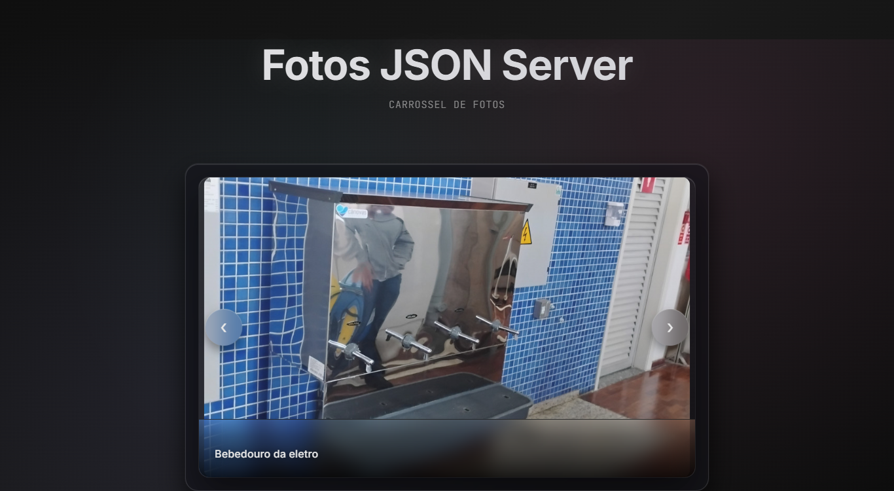

<div align="center">

# Carrossel JSON Server

<p align="center">
  <strong>Projeto de volta ás aulas do curso de Desenvolvimento de Sistemas do SENAI Jandira</strong>
</p>

<p align="center">
  
</p>

<div align="center">

</div>

---

## ✨ Sobre o Projeto

O **Projeto Carrossel JSON Server** é uma aplicação web que oferece a navegação de fotos tiradas na escola técnica SENAI Jandira.

## 🛠️ Tecnologias Utilizadas

<div align="center">

| Frontend | Backend | Estilo |
|:--------:|:-------:|:------:|
|  |  |  |
|  |  |  |

</div>

---

## 🚀 Como Executar

### Pré-requisitos

```bash
# Node.js instalado em sua máquina
# npm ou yarn como gerenciador de pacotes
```

### Instalação

<details>
<summary><strong>📋 Passo a passo</strong></summary>

1. **Clone o repositório**
   ```bash
   git clone <url-do-repositorio>
   cd ProjetoJSONserver
   ```

2. **Instale as dependências**
   ```bash
   npm install
   ```

3. **Inicie o JSON Server**
   ```bash
   npm start
   # ou
   npx json-server --watch API/db.json --port 3000
   ```

4. **Abra o projeto**
   - Navegue até `FrontEnd/index.html`
   - Abra em um servidor local ou diretamente no navegador

</details>

---

## 🎯 Funcionalidades Detalhadas

<div align="center">

| Funcionalidade | Descrição | Status |
|:---------------|:----------|:------:|
| **Carrossel Horizontal** | Navegação fluida entre fotos com laterais visíveis | ✅ |
| **Loop Infinito** | Navegação contínua sem fim de lista | ✅ |
| **Fotos Ofuscadas** | Efeito blur nas fotos laterais | ✅ |
| **Legendas Animadas** | Legendas que deslizam suavemente | ✅ |
| **Design Responsivo** | Adaptação para dispositivos móveis | ✅ |
| **Efeitos Translúcidos** | Elementos com backdrop-filter | ✅ |

</div>
</div>
